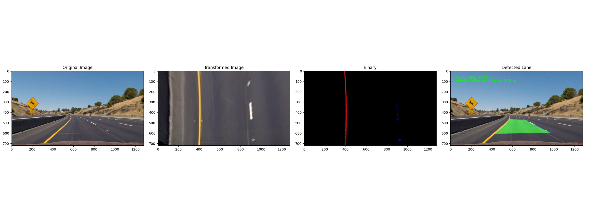

## Advanced Lane Finding
[](http://www.udacity.com/drive)


## HOW TO USE

### 1. Camera Calibration

```
python src/camera.py --cal_img_dir /path/to/calibration/chessboard/images --calibration_output_dir /path/to/directory/to/store/calibrated/images
```

more arguments
```
--input_img, input image to undistort
--output_dir, directory to save undistorted image
--cfg_filename, camera configuration file name

```

### 2. Perspective Transform

After calibrating the camera, we need to get the perspective transform of the road. This script helps us getting the transformation , and inverse transformation matrix.

```
python src/perspective_transform.py --image /path/to/image --cfg_filename /path/to/configuratio/file/to/save/configuration --camera_cfg_filename /path/to/camera/configuration/file
```

more arguments:

```
--threshold, threshold for perspective transformation. default: 400
--plot, to plot or not to plot.

```

### 3. Binary Transform

After transforming the perspective, we have to get tune the binary thresholds. So that we can get the binary images.

```
python  src/binary_transform.py --image_dir /path/to/images/to/get/binary/thresholds --cfg_filename /path/to/binary/threshold/configuration/file --camera_cfg_file /path/to/camera/configuration/file --pt_cfg_filename /path/to/perspective/transform/configuration/file 

```

more argument:

```
--img_size, image size, default: 720,1280

```

### 4. Lane Detection

After getting all the configuration files, i.e. Camera Calibration, Perspective Transformation, and Binary transformation , it is time to detect the lane.

#### From Directory of images

```
python src/lane_detection.py --input test_images --camera_cfg_filename config/camera_config.yaml --pt_cfg_filename config/pt_config.yaml --binary_cfg_filename config/camera_config.yaml --img_size 720 1280

```
It will save the output images in `test_images/lane_detected` folder


#### From Video

```
python src/lane_detection.py --input project_video.mp4 --camera_cfg_filename config/camera_config.yaml --pt_cfg_filename config/pt_config.yaml --binary_cfg_filename config/camera_config.yaml --img_size 720 1280

```
[Video Link](https://youtu.be/NudXllMCQsQ)

It will save the output video as `project_video_output.avi` .

## TODO:

- [ ] Tune more to get better results
- [ ] Work on Challenge Videos
- [ ] Make a Docker environment
- [ ] Refactor
